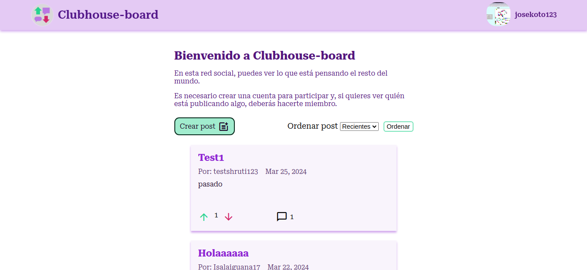
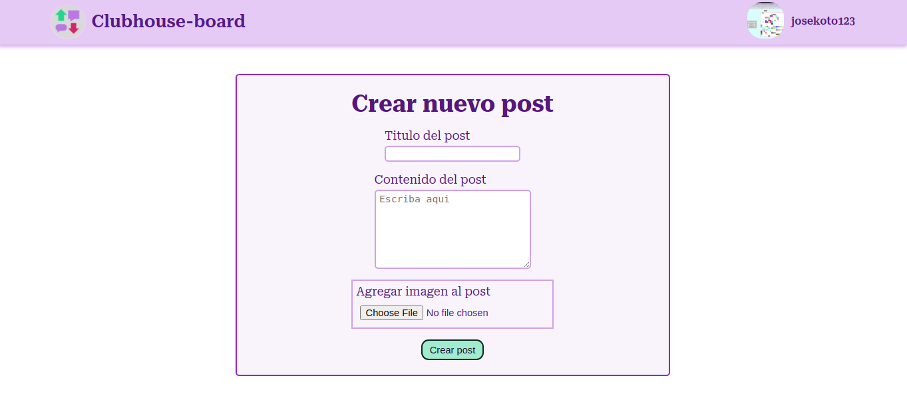
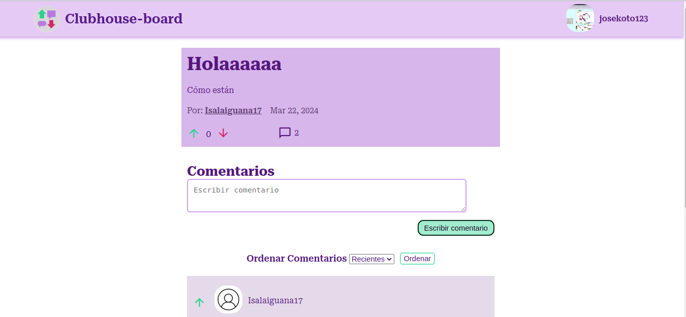
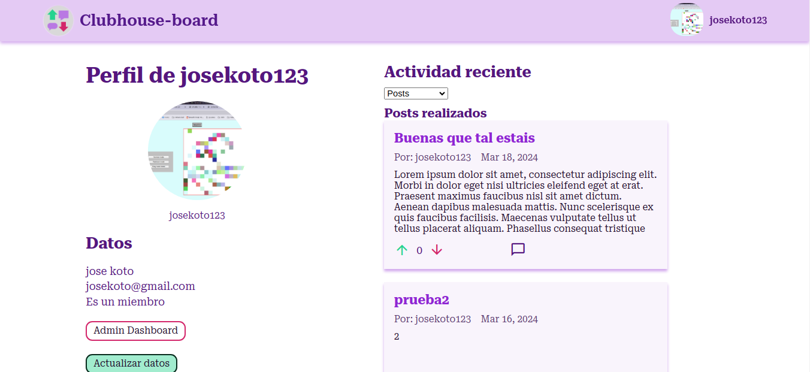

<!--Project Logo and Name-->
<h1 align="center">
    <!-- project url -->
    <a href="https://harvest-slime-piano.glitch.me/blog/posts" target="_blank">
        <!-- project logo -->
        
     
    <!-- project name -->
    Clubhouse-board
    </a>
</h1>
<!-- project description (concise) -->
<h4 align="center">Red social inspirada en Reddit</h4>

<!-- Features -->

# Caracteristicas

- Diseño responsive
- Posibilidad de tener una cuenta
  - Es necesario tener una cuenta para crear posts o comentarios
  - Se puede mejorar una cuenta a miembro para obtener caracteristicas adicionales
- Creación de posts y comentarios
  - Los usuarios registrados pueden crear posts y comentarios
  - Solo los usuarios miembros pueden ver el autor y la fecha de creacion del post o comentario
- Sistema de puntuación para posts y comentarios
  - Los usuarios pueden dar una valoración positiva a los posts y comentarios
- Panel de administración
  - Permite a los administradores eliminar posts y comentarios
- Autenticacion de usuarios basada en el el uso de cookies y sessions con PassportJS

<!--Screenshots-->

## Aspecto en computadora

Pagina de inicio

Creación de post

Detalles de producto

Perfil de usuario

<!-- Tech Stack -->

## Tecnologias usadas

Las tecnologias usadas para realizar esta pagina fueron:

- HTML
- Javascript
- CSS
- [Express](https://expressjs.com/)
- [EJS](https://ejs.co/)
- [MongoDB](https://www.mongodb.com/)
- [PassportJS](https://www.passportjs.org/)
